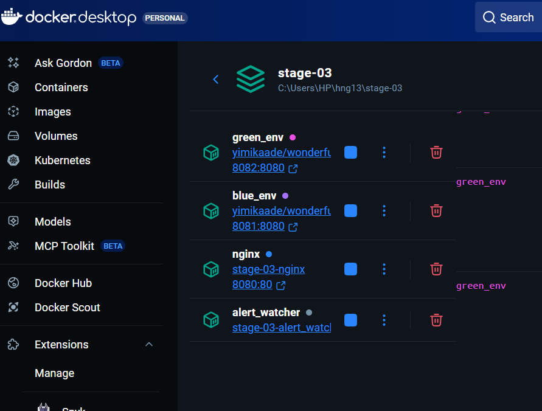
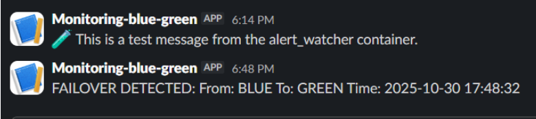
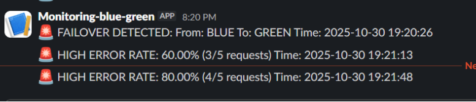

# Blue/Green Deployment Monitoring Runbook


## Purpose

This document provides operational guidance for the Blue/Green Node.js deployment and its monitoring system. It explains how to respond to alerts, perform maintenance, and troubleshoot common issues.

---

## System Overview

*   **Infrastructure:** Two identical Node.js application pools (Blue and Green) sit behind an Nginx reverse proxy.
*   **Traffic Routing:** By default, all traffic goes to the `ACTIVE_POOL`. If the active pool fails, Nginx automatically fails over to the backup pool with zero downtime.
*   **Monitoring:** A Python `alert_watcher` service tails Nginx logs in real-time and sends alerts to Slack for failovers and high error rates.

---

## Alerting

This section explains the automated alerts you will receive in your dedicated Slack channel.

### 1. Failover Alert

**Message Format:**
> 🚨 **FAILOVER DETECTED: From: {PREVIOUS_POOL} To: {CURRENT_POOL} Time: {YYYY-MM-DD HH:MM:SS}**

**Meaning:** The system has automatically switched traffic from one pool to another because the primary pool became unhealthy (e.g., returned 5xx errors or timed out).



**Immediate Actions:**

1.  **Acknowledge the Alert:** React to the Slack message to let the team know you are investigating.
2.  **Check the Health of the Failed Pool:**
    *   Identify the failed pool from the alert (the `From:` pool).
    *   Make a direct request to its port to confirm the failure:
        *   If Blue failed: `curl http://localhost:8081/version`
        *   If Green failed: `curl http://localhost:8082/version`
    *   You should receive an error (e.g., `500 Internal Server Error` or a timeout).
3.  **Investigate the Root Cause:**
    *   Check the application logs for the failed container:
        ```powershell
        docker-compose logs blue_env   # or green_env
        ```
    *   Check the Nginx logs for clues:
        ```powershell
        docker-compose logs nginx
        ```
    *   Check container resource usage:
        ```powershell
        docker stats
        ```

### 2. High Error Rate Alert

**Message Format:**
> 🚨 **HIGH ERROR RATE: {PERCENTAGE}% ({ERROR_COUNT}/{TOTAL_REQUESTS} requests) Time: {YYYY-MM-DD HH:MM:SS}**



**Meaning:** The system is experiencing an elevated rate of 5xx errors from the upstream services, exceeding the defined threshold (default 2%).

**Immediate Actions:**

1.  **Acknowledge the Alert.**
2.  **Identify the Affected Pool(s):**
    *   Check the recent Nginx logs to see which pool is generating errors.
        ```powershell
        docker-compose exec nginx tail /var/log/nginx/access.log
        ```
    *   Look for log lines with `upstream_status=5xx`. The `pool=` field will tell you which pool is the source.
3.  **Investigate the Root Cause:**
    *   If only one pool is affected, follow the same investigation steps as the Failover Alert.
    *   If **both** pools are affected, this indicates a systemic issue (e.g., database connectivity problem, bad deployment, shared dependency failure).
4.  **Mitigation:**
    *   If only one pool is affected, consider a manual failover to the healthy pool while you investigate the failed one. See [Manual Pool Switching](#manual-pool-switching) below.
    *   If both pools are affected, the priority is to restore service. This may require rolling back a recent deployment or fixing the underlying systemic issue.

---

## Operational Procedures

### Maintenance Mode

**Purpose:** To suppress non-actionable alerts during planned operational work (e.g., deployments, manual switchovers).

**How to Enable:**

1.  Open your `.env` file.
2.  Change `MAINTENANCE_MODE=false` to `MAINTENANCE_MODE=true`.
3.  Restart the `alert_watcher` service to apply the change:
    ```powershell
    docker-compose restart alert_watcher
    ```
4.  Verify by checking the watcher logs: `docker-compose logs alert_watcher`. You should see `Maintenance mode: True`.

**How to Disable:**
1.  Set `MAINTENANCE_MODE=false` in your `.env` file.
2.  Restart the `alert_watcher` service.
3.  **CRITICAL:** Always remember to disable maintenance mode after you finish your work.

---

## Troubleshooting

### I'm not receiving alerts in Slack.

1.  **Check the `alert_watcher` logs:**
    ```powershell
    docker-compose logs alert_watcher
    ```
    Look for errors like "Failed to send alert to Slack" or "Slack webhook URL not configured".
2.  **Verify the Webhook URL:** Ensure the `SLACK_WEBHOOK_URL` in your `.env` file is correct and has not been revoked.
3.  **Test the Webhook Manually:**
    ```powershell
    docker-compose exec alert_watcher python /app/test_slack.py
    ```
    If this fails, the issue is with the URL or network connectivity.
4.  **Check if the Watcher is Processing Logs:** Make a request and see if the watcher logs show the `RAW LOG LINE` and `PARSED DATA` messages. If not, there is a volume mount issue.

### The `alert_watcher` service is not reading logs.

1.  **Verify the Volume Mount:**
    *   Check if the log file exists in the container:
        ```powershell
        docker-compose exec alert_watcher ls -l /var/log/nginx/
        ```
    *   Check if the log file exists on the host machine:
        ```powershell
        type .\logs\access.log
        ```
2.  **Restart the Service:** A restart can fix issues with stale file handles.
    ```powershell
    docker-compose restart alert_watcher
    ```
3.  **Check for Regex Mismatches:** If you see "LOG LINE DID NOT MATCH REGEX!" in the logs, the Nginx log format has changed and the regex in `watcher.py` needs to be updated.

### A request to `http://localhost:8080` is failing.

1.  **Check if all containers are running:**
    ```powershell
    docker-compose ps
    ```
    All services (`nginx`, `blue_env`, `green_env`) should have a status of `Up`.
2.  **Check Nginx Configuration:**
    ```powershell
    docker-compose exec nginx nginx -t
    ```
    This will report any syntax errors in the Nginx configuration.
3.  **Check Nginx Logs:**
    ```powershell
    docker-compose logs nginx
    ```
    Look for connection errors or other issues.

---

## Key Concepts

*   **Active Pool:** The application pool currently serving live traffic.
*   **Backup Pool:** The idle application pool that will take over if the active pool fails.
*   **Failover:** The automatic process of switching traffic from the active pool to the backup pool.
*   **Volume Mount:** The mechanism that shares the `./logs` directory between the `nginx` and `alert_watcher` containers.
*   **Maintenance Mode:** A setting to suppress alerts during planned work.